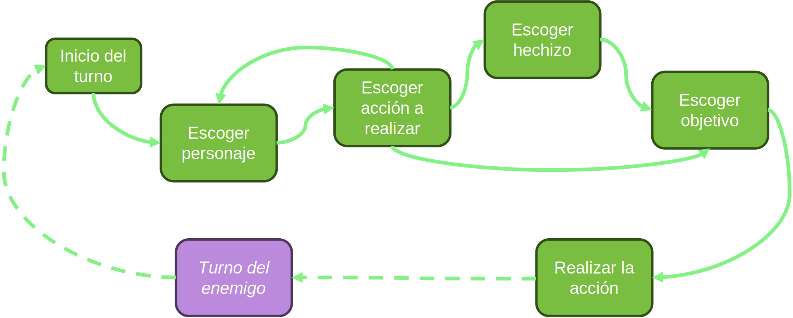

# Auxiliar 9: Patrones de Diseño 1

Su auxiliar favorito (también conocido como Vicente González) les ha pedido un favor: 
Ayudarlo con un pequeño juego basado en su anime favorito: _Jujutsu Kaisen_.

A grandes rasgos, _Jujutsu Kaisen_ es una serie sobre hechicería, donde los hechiceros usan energía maldita para lanzar hechizos. 
Estos (generalmente) luchan contra maldiciones para proteger a las personas.

La idea es simular una batalla entre hechiceros y maldiciones.

Su auxiliar conoce sus capacidades y es por esto que confía plenamente en sus habilidades.
El auxiliar tiene listo todo el modelo necesario para hacer el juego, pero no tiene tiempo para hacer el controlador
porque tiene que preparar una clase auxiliar de otro curso :C

Como es su auxiliar favorito, ustedes decidieron ayudarlo.

## Problema 1
Inicialmente, debe definir el flujo de la batalla, para eso es necesario establecer un controlador del juego o `GameController`.

Afortunadamente, el auxiliar avanzo bastante en este apartado, lo único que debe hacer usted es rellenar los métodos faltantes.

Requisitos:
- El controlador puede añadir observadores para el ataque y el uso de hechizos
- El controlador puede cambiar su estado
- El controlador puede decir si tiene un hechizo seleccionado o no
- El controlador puede seleccionar un personaje y un objetivo tanto para aliados como enemigos
- El controlador puede hacer un ataque entre el personaje seleccionado y su objetivo
- El controlado puede usar un hechizo entre el personaje seleccionado, su hechizo seleccionado y su objetivo
- El controlador puede correr el juego
- El juego se termina cuando se gana o se pierde
- Se gana si todos los enemigos mueren
- Se pierde si todos los aliados mueren

¡Muy bien!

Ahora que el controlador está listo, solo deben hacer lo más difícil: el flujo del juego :D

Para ello, su auxiliar les proporcionará un diagrama muy básico con los estados y sus transiciones.

Primero vea el flujo en el turno del jugador y luego haga el de los enemigos

## Problema 2
Su auxiliar quedo muy encantado con su solución, tanto así que ahora les pidió un favor extra.

En la serie, el personaje Satoru Gojo se caracteriza por ser bromista y no tomarse muy en serio los combates debido a su enorme poder.

Es por esto que a su auxiliar le gustaría que añadieran un nuevo observer, que represente las interacciones de Satoru cuando ocurre un ataque.

Ejemplo:

- Cuando Satoru ataca a una maldición:
    > Satoru: Toma eso!

- Cuando otro aliado recibe daño:
    > Satoru: Aguanta ahí {_nombre del aliado_}

Requisitos:
- Satoru felicita a sus aliados cuando usan hechizos
- Satoru calma a los aliados que sobreviven a cualquier ataque
- Satoru se enoja cuando un aliado muere
- Satoru se burla de los enemigos cuando usan un hechizo sobre el
- Satoru provoca a los enemigos que usan un ataque normal sobre sus aliados
- Satoru hace distintas expresiones para cada uno de sus ataques
